# General Information

In the following analysis I will conduct some exploratory data analysis on the 
Prosper Loans data set. According to their website “Prosper is America’s first 
marketplace lending platform, with over $7 billion in funded loans. Prosper 
allows people to invest in each other in a way that is financially and 
socially rewarding.” See also the Prosper Homepage.  
    
The data set at hand contains 113,937 loans with 81 variables on each loan, 
including loan amount, borrower rate (or interest rate), current loan status, 
borrower income, borrower employment status, borrower credit history, and the 
latest payment information. The dataset contains loans created between 
2005-Q4 and 2014-Q1.
  
Variable Definitions for the Prosper Loans Dataset can be found here:[Variable Definitions.](https://docs.google.com/spreadsheets/d/1gDyi_L4UvIrLTEC6Wri5nbaMmkGmLQBk-Yx3z0XDEtI/edit#gid=0) 
  
For the following analysis I will focus on 28 variables, which I pre-selected 
based on my subjective assumptions. I expect that those variables will reveal 
some interesting insights about Prosper loans.


```
##  [1] "ListingKey"                         
##  [2] "ListingNumber"                      
##  [3] "ListingCreationDate"                
##  [4] "CreditGrade"                        
##  [5] "Term"                               
##  [6] "LoanStatus"                         
##  [7] "ClosedDate"                         
##  [8] "BorrowerAPR"                        
##  [9] "BorrowerRate"                       
## [10] "LenderYield"                        
## [11] "EstimatedEffectiveYield"            
## [12] "EstimatedLoss"                      
## [13] "EstimatedReturn"                    
## [14] "ProsperRating..numeric."            
## [15] "ProsperRating..Alpha."              
## [16] "ProsperScore"                       
## [17] "ListingCategory..numeric."          
## [18] "BorrowerState"                      
## [19] "Occupation"                         
## [20] "EmploymentStatus"                   
## [21] "EmploymentStatusDuration"           
## [22] "IsBorrowerHomeowner"                
## [23] "CurrentlyInGroup"                   
## [24] "GroupKey"                           
## [25] "DateCreditPulled"                   
## [26] "CreditScoreRangeLower"              
## [27] "CreditScoreRangeUpper"              
## [28] "FirstRecordedCreditLine"            
## [29] "CurrentCreditLines"                 
## [30] "OpenCreditLines"                    
## [31] "TotalCreditLinespast7years"         
## [32] "OpenRevolvingAccounts"              
## [33] "OpenRevolvingMonthlyPayment"        
## [34] "InquiriesLast6Months"               
## [35] "TotalInquiries"                     
## [36] "CurrentDelinquencies"               
## [37] "AmountDelinquent"                   
## [38] "DelinquenciesLast7Years"            
## [39] "PublicRecordsLast10Years"           
## [40] "PublicRecordsLast12Months"          
## [41] "RevolvingCreditBalance"             
## [42] "BankcardUtilization"                
## [43] "AvailableBankcardCredit"            
## [44] "TotalTrades"                        
## [45] "TradesNeverDelinquent..percentage." 
## [46] "TradesOpenedLast6Months"            
## [47] "DebtToIncomeRatio"                  
## [48] "IncomeRange"                        
## [49] "IncomeVerifiable"                   
## [50] "StatedMonthlyIncome"                
## [51] "LoanKey"                            
## [52] "TotalProsperLoans"                  
## [53] "TotalProsperPaymentsBilled"         
## [54] "OnTimeProsperPayments"              
## [55] "ProsperPaymentsLessThanOneMonthLate"
## [56] "ProsperPaymentsOneMonthPlusLate"    
## [57] "ProsperPrincipalBorrowed"           
## [58] "ProsperPrincipalOutstanding"        
## [59] "ScorexChangeAtTimeOfListing"        
## [60] "LoanCurrentDaysDelinquent"          
## [61] "LoanFirstDefaultedCycleNumber"      
## [62] "LoanMonthsSinceOrigination"         
## [63] "LoanNumber"                         
## [64] "LoanOriginalAmount"                 
## [65] "LoanOriginationDate"                
## [66] "LoanOriginationQuarter"             
## [67] "MemberKey"                          
## [68] "MonthlyLoanPayment"                 
## [69] "LP_CustomerPayments"                
## [70] "LP_CustomerPrincipalPayments"       
## [71] "LP_InterestandFees"                 
## [72] "LP_ServiceFees"                     
## [73] "LP_CollectionFees"                  
## [74] "LP_GrossPrincipalLoss"              
## [75] "LP_NetPrincipalLoss"                
## [76] "LP_NonPrincipalRecoverypayments"    
## [77] "PercentFunded"                      
## [78] "Recommendations"                    
## [79] "InvestmentFromFriendsCount"         
## [80] "InvestmentFromFriendsAmount"        
## [81] "Investors"
```

```
## Observations: 113,937
## Variables: 81
## $ ListingKey                          <fctr> 1021339766868145413AB3B, ...
## $ ListingNumber                       <int> 193129, 1209647, 81716, 65...
## $ ListingCreationDate                 <fctr> 2007-08-26 19:09:29.26300...
## $ CreditGrade                         <fctr> C, , HR, , , , , , , , , ...
## $ Term                                <int> 36, 36, 36, 36, 36, 60, 36...
## $ LoanStatus                          <fctr> Completed, Current, Compl...
## $ ClosedDate                          <fctr> 2009-08-14 00:00:00, , 20...
## $ BorrowerAPR                         <dbl> 0.16516, 0.12016, 0.28269,...
## $ BorrowerRate                        <dbl> 0.1580, 0.0920, 0.2750, 0....
## $ LenderYield                         <dbl> 0.1380, 0.0820, 0.2400, 0....
## $ EstimatedEffectiveYield             <dbl> NA, 0.07960, NA, 0.08490, ...
## $ EstimatedLoss                       <dbl> NA, 0.0249, NA, 0.0249, 0....
## $ EstimatedReturn                     <dbl> NA, 0.05470, NA, 0.06000, ...
## $ ProsperRating..numeric.             <int> NA, 6, NA, 6, 3, 5, 2, 4, ...
## $ ProsperRating..Alpha.               <fctr> , A, , A, D, B, E, C, AA,...
## $ ProsperScore                        <dbl> NA, 7, NA, 9, 4, 10, 2, 4,...
## $ ListingCategory..numeric.           <int> 0, 2, 0, 16, 2, 1, 1, 2, 7...
## $ BorrowerState                       <fctr> CO, CO, GA, GA, MN, NM, K...
## $ Occupation                          <fctr> Other, Professional, Othe...
## $ EmploymentStatus                    <fctr> Self-employed, Employed, ...
## $ EmploymentStatusDuration            <int> 2, 44, NA, 113, 44, 82, 17...
## $ IsBorrowerHomeowner                 <fctr> True, False, False, True,...
## $ CurrentlyInGroup                    <fctr> True, False, True, False,...
## $ GroupKey                            <fctr> , , 783C3371218786870A73D...
## $ DateCreditPulled                    <fctr> 2007-08-26 18:41:46.78000...
## $ CreditScoreRangeLower               <int> 640, 680, 480, 800, 680, 7...
## $ CreditScoreRangeUpper               <int> 659, 699, 499, 819, 699, 7...
## $ FirstRecordedCreditLine             <fctr> 2001-10-11 00:00:00, 1996...
## $ CurrentCreditLines                  <int> 5, 14, NA, 5, 19, 21, 10, ...
## $ OpenCreditLines                     <int> 4, 14, NA, 5, 19, 17, 7, 6...
## $ TotalCreditLinespast7years          <int> 12, 29, 3, 29, 49, 49, 20,...
## $ OpenRevolvingAccounts               <int> 1, 13, 0, 7, 6, 13, 6, 5, ...
## $ OpenRevolvingMonthlyPayment         <dbl> 24, 389, 0, 115, 220, 1410...
## $ InquiriesLast6Months                <int> 3, 3, 0, 0, 1, 0, 0, 3, 1,...
## $ TotalInquiries                      <dbl> 3, 5, 1, 1, 9, 2, 0, 16, 6...
## $ CurrentDelinquencies                <int> 2, 0, 1, 4, 0, 0, 0, 0, 0,...
## $ AmountDelinquent                    <dbl> 472, 0, NA, 10056, 0, 0, 0...
## $ DelinquenciesLast7Years             <int> 4, 0, 0, 14, 0, 0, 0, 0, 0...
## $ PublicRecordsLast10Years            <int> 0, 1, 0, 0, 0, 0, 0, 1, 0,...
## $ PublicRecordsLast12Months           <int> 0, 0, NA, 0, 0, 0, 0, 0, 0...
## $ RevolvingCreditBalance              <dbl> 0, 3989, NA, 1444, 6193, 6...
## $ BankcardUtilization                 <dbl> 0.00, 0.21, NA, 0.04, 0.81...
## $ AvailableBankcardCredit             <dbl> 1500, 10266, NA, 30754, 69...
## $ TotalTrades                         <dbl> 11, 29, NA, 26, 39, 47, 16...
## $ TradesNeverDelinquent..percentage.  <dbl> 0.81, 1.00, NA, 0.76, 0.95...
## $ TradesOpenedLast6Months             <dbl> 0, 2, NA, 0, 2, 0, 0, 0, 1...
## $ DebtToIncomeRatio                   <dbl> 0.17, 0.18, 0.06, 0.15, 0....
## $ IncomeRange                         <fctr> $25,000-49,999, $50,000-7...
## $ IncomeVerifiable                    <fctr> True, True, True, True, T...
## $ StatedMonthlyIncome                 <dbl> 3083.3333, 6125.0000, 2083...
## $ LoanKey                             <fctr> E33A3400205839220442E84, ...
## $ TotalProsperLoans                   <int> NA, NA, NA, NA, 1, NA, NA,...
## $ TotalProsperPaymentsBilled          <int> NA, NA, NA, NA, 11, NA, NA...
## $ OnTimeProsperPayments               <int> NA, NA, NA, NA, 11, NA, NA...
## $ ProsperPaymentsLessThanOneMonthLate <int> NA, NA, NA, NA, 0, NA, NA,...
## $ ProsperPaymentsOneMonthPlusLate     <int> NA, NA, NA, NA, 0, NA, NA,...
## $ ProsperPrincipalBorrowed            <dbl> NA, NA, NA, NA, 11000, NA,...
## $ ProsperPrincipalOutstanding         <dbl> NA, NA, NA, NA, 9947.90, N...
## $ ScorexChangeAtTimeOfListing         <int> NA, NA, NA, NA, NA, NA, NA...
## $ LoanCurrentDaysDelinquent           <int> 0, 0, 0, 0, 0, 0, 0, 0, 0,...
## $ LoanFirstDefaultedCycleNumber       <int> NA, NA, NA, NA, NA, NA, NA...
## $ LoanMonthsSinceOrigination          <int> 78, 0, 86, 16, 6, 3, 11, 1...
## $ LoanNumber                          <int> 19141, 134815, 6466, 77296...
## $ LoanOriginalAmount                  <int> 9425, 10000, 3001, 10000, ...
## $ LoanOriginationDate                 <fctr> 2007-09-12 00:00:00, 2014...
## $ LoanOriginationQuarter              <fctr> Q3 2007, Q1 2014, Q1 2007...
## $ MemberKey                           <fctr> 1F3E3376408759268057EDA, ...
## $ MonthlyLoanPayment                  <dbl> 330.43, 318.93, 123.32, 32...
## $ LP_CustomerPayments                 <dbl> 11396.1400, 0.0000, 4186.6...
## $ LP_CustomerPrincipalPayments        <dbl> 9425.00, 0.00, 3001.00, 40...
## $ LP_InterestandFees                  <dbl> 1971.1400, 0.0000, 1185.63...
## $ LP_ServiceFees                      <dbl> -133.18, 0.00, -24.20, -10...
## $ LP_CollectionFees                   <dbl> 0, 0, 0, 0, 0, 0, 0, 0, 0,...
## $ LP_GrossPrincipalLoss               <dbl> 0.00, 0.00, 0.00, 0.00, 0....
## $ LP_NetPrincipalLoss                 <dbl> 0.00, 0.00, 0.00, 0.00, 0....
## $ LP_NonPrincipalRecoverypayments     <dbl> 0.00, 0.00, 0.00, 0.00, 0....
## $ PercentFunded                       <dbl> 1.0000, 1.0000, 1.0000, 1....
## $ Recommendations                     <int> 0, 0, 0, 0, 0, 0, 0, 0, 0,...
## $ InvestmentFromFriendsCount          <int> 0, 0, 0, 0, 0, 0, 0, 0, 0,...
## $ InvestmentFromFriendsAmount         <dbl> 0, 0, 0, 0, 0, 0, 0, 0, 0,...
## $ Investors                           <int> 258, 1, 41, 158, 20, 1, 1,...
```
# Data Wrangling

Prior to performing my analysis I did small amount of data wrandgling to 
remove unused columns and convert the data set to a tibble. I used the
lubridate library functionsto convert the dates from factors to dates. 
I also releveled LoanOriginationQuarter which appeared to be out of order.
I used cut to create custom levels of DebtToIncomeRatio and corresponding 
factor.


```r
#Echo the creation of categorical variables per rubric

#Create a custom variable for DTI Ratio and associated factor
loans$DebtToIncomeRatioLevel<-cut(loans$DebtToIncomeRatio, 
  c(0, .10, .20, .30, .40, .50), c("Excellent", "Good", "Fair", "Poor", "Bad"))

loans$DebtToIncomeRatioLevel <- factor(loans$DebtToIncomeRatioLevel, 
  levels = c("Excellent", "Good", "Fair", "Poor", "Bad"))

levels(loans$DebtToIncomeRatioLevel)
```

```
## [1] "Excellent" "Good"      "Fair"      "Poor"      "Bad"
```


```r
#Echo the creation of categorical variables per rubric

#create function to rename labels
rename_listingCat <- function(i_listing) {
  #return a string with renamed status passed
  if (i_listing==0){ 'Not Available'}
  else if (i_listing==1){'Debt consolidation'}
  else if (i_listing==2){'Home Improvement'}
  else if (i_listing==3){'Business'}
  else if (i_listing==4){'Personal Loans'}
  else if (i_listing==5){'Student Loan'}  
  else if (i_listing==6){'Auto'}
  else if (i_listing==7){'Other'}
  else if (i_listing==8){'Baby/Adoption'}
  else if (i_listing==9){'Boat'}  
  else if (i_listing==10){'Cosmetic Procedure'}
  else if (i_listing==11){'Engagment Ring'}  
  else if (i_listing==12){'Green Loans'}
  else if (i_listing==13){'Housing Expenses'} 
  else if (i_listing==14){'Large Purchases'}
  else if (i_listing==15){'Medical/Dental'}
  else if (i_listing==16){'Motorcycle'}
  else if (i_listing==17){'Rv'} 
  else if (i_listing==18){'Taxes'}
  else if (i_listing==19){'Vacation'}
  else if (i_listing==20){'Wedding Loans'}  
}

#create a new variable with renamed loan status
loans$ListingCategory.renamed <- apply(loans['ListingCategory..numeric.'],1,
  rename_listingCat)
```


```
##  [1] "IncomeRange"                 "LoanOriginalAmount"         
##  [3] "BorrowerRate"                "ProsperRating..numeric."    
##  [5] "BorrowerState"               "EmploymentStatus"           
##  [7] "EmploymentStatusDuration"    "LenderYield"                
##  [9] "ListingCategory..numeric."   "IsBorrowerHomeowner"        
## [11] "Recommendations"             "DebtToIncomeRatio"          
## [13] "ProsperScore"                "Investors"                  
## [15] "MonthlyLoanPayment"          "ClosedDate"                 
## [17] "LoanOriginationDate"         "LoanStatus"                 
## [19] "EstimatedReturn"             "EstimatedLoss"              
## [21] "Occupation"                  "OpenRevolvingMonthlyPayment"
## [23] "LoanOriginationQuarter"      "RevolvingCreditBalance"     
## [25] "ProsperRating..Alpha."       "StatedMonthlyIncome"        
## [27] "DebtToIncomeRatioLevel"      "ListingCategory.renamed"
```

```
## Observations: 113,937
## Variables: 28
## $ IncomeRange                 <fctr> $25,000-49,999, $50,000-74,999, N...
## $ LoanOriginalAmount          <int> 9425, 10000, 3001, 10000, 15000, 1...
## $ BorrowerRate                <dbl> 0.1580, 0.0920, 0.2750, 0.0974, 0....
## $ ProsperRating..numeric.     <int> NA, 6, NA, 6, 3, 5, 2, 4, 7, 7, 4,...
## $ BorrowerState               <fctr> CO, CO, GA, GA, MN, NM, KS, CA, I...
## $ EmploymentStatus            <fctr> Self-employed, Employed, Not avai...
## $ EmploymentStatusDuration    <int> 2, 44, NA, 113, 44, 82, 172, 103, ...
## $ LenderYield                 <dbl> 0.1380, 0.0820, 0.2400, 0.0874, 0....
## $ ListingCategory..numeric.   <int> 0, 2, 0, 16, 2, 1, 1, 2, 7, 7, 1, ...
## $ IsBorrowerHomeowner         <fctr> True, False, False, True, True, T...
## $ Recommendations             <int> 0, 0, 0, 0, 0, 0, 0, 0, 0, 0, 0, 0...
## $ DebtToIncomeRatio           <dbl> 0.17, 0.18, 0.06, 0.15, 0.26, 0.36...
## $ ProsperScore                <dbl> NA, 7, NA, 9, 4, 10, 2, 4, 9, 11, ...
## $ Investors                   <int> 258, 1, 41, 158, 20, 1, 1, 1, 1, 1...
## $ MonthlyLoanPayment          <dbl> 330.43, 318.93, 123.32, 321.45, 56...
## $ ClosedDate                  <dttm> 2009-08-14, NA, 2009-12-17, NA, N...
## $ LoanOriginationDate         <dttm> 2007-09-12, 2014-03-03, 2007-01-1...
## $ LoanStatus                  <fctr> Completed, Current, Completed, Cu...
## $ EstimatedReturn             <dbl> NA, 0.05470, NA, 0.06000, 0.09066,...
## $ EstimatedLoss               <dbl> NA, 0.0249, NA, 0.0249, 0.0925, 0....
## $ Occupation                  <fctr> Other, Professional, Other, Skill...
## $ OpenRevolvingMonthlyPayment <dbl> 24, 389, 0, 115, 220, 1410, 214, 1...
## $ LoanOriginationQuarter      <fctr> Q3 2007, NA, Q1 2007, Q4 2012, Q3...
## $ RevolvingCreditBalance      <dbl> 0, 3989, NA, 1444, 6193, 62999, 58...
## $ ProsperRating..Alpha.       <fctr> , A, , A, D, B, E, C, AA, AA, C, ...
## $ StatedMonthlyIncome         <dbl> 3083.3333, 6125.0000, 2083.3333, 2...
## $ DebtToIncomeRatioLevel      <fctr> Good, Good, Excellent, Good, Fair...
## $ ListingCategory.renamed     <chr> "Not Available", "Home Improvement...
```


# Univariate Plots Section

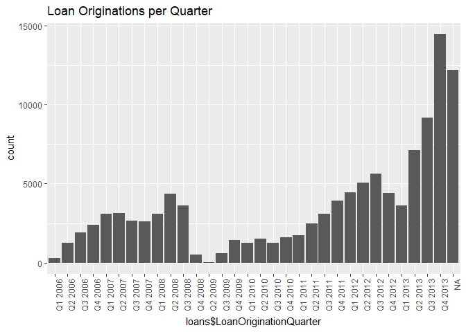<!-- -->

```
## Q1 2006 Q2 2006 Q3 2006 Q4 2006 Q1 2007 Q2 2007 Q3 2007 Q4 2007 Q1 2008 
##     315    1254    1934    2403    3079    3118    2671    2592    3074 
## Q2 2008 Q3 2008 Q4 2008 Q1 2009 Q2 2009 Q3 2009 Q4 2009 Q1 2010 Q2 2010 
##    4344    3602     532       0      13     585    1449    1243    1539 
## Q3 2010 Q4 2010 Q1 2011 Q2 2011 Q3 2011 Q4 2011 Q1 2012 Q2 2012 Q3 2012 
##    1270    1600    1744    2478    3093    3913    4435    5061    5632 
## Q4 2012 Q1 2013 Q2 2013 Q3 2013 Q4 2013    NA's 
##    4425    3616    7099    9180   14450   12194
```

**_How many loans are they making?_** This chart shows the number of loans 
originated by quarter. This shows that the number of origination increased from 
2006 and then things fell off in 2008 to essentially nothing in early 2009 
corresponding to their SEC relaunch. The trend has increased since late 2009.

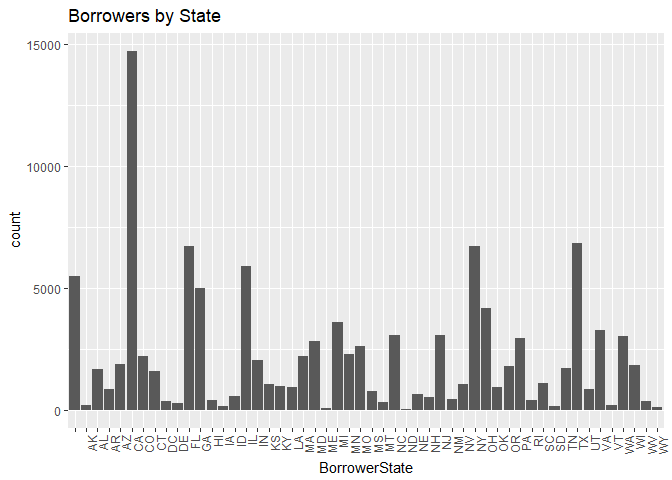<!-- -->

```
##          AK    AL    AR    AZ    CA    CO    CT    DC    DE    FL    GA 
##  5515   200  1679   855  1901 14717  2210  1627   382   300  6720  5008 
##    HI    IA    ID    IL    IN    KS    KY    LA    MA    MD    ME    MI 
##   409   186   599  5921  2078  1062   983   954  2242  2821   101  3593 
##    MN    MO    MS    MT    NC    ND    NE    NH    NJ    NM    NV    NY 
##  2318  2615   787   330  3084    52   674   551  3097   472  1090  6729 
##    OH    OK    OR    PA    RI    SC    SD    TN    TX    UT    VA    VT 
##  4197   971  1817  2972   435  1122   189  1737  6842   877  3278   207 
##    WA    WI    WV    WY 
##  3048  1842   391   150
```

**_So where are we making the loans?_**  It appears that the largest number of 
loans are made to people in CA. The data also appears to align with the states 
with higher populations (i.e., CA, FL, NY, TX) originaing more loans


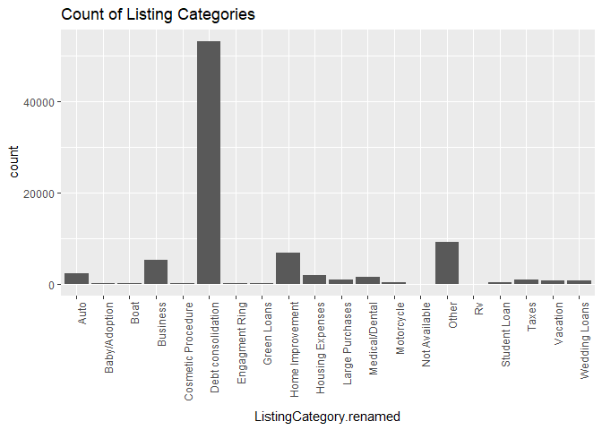<!-- -->

```
##    Length     Class      Mode 
##    113937 character character
```

**_So what are people borrowing for?_** It looks like the majority of the loans 
are for debt consolidation

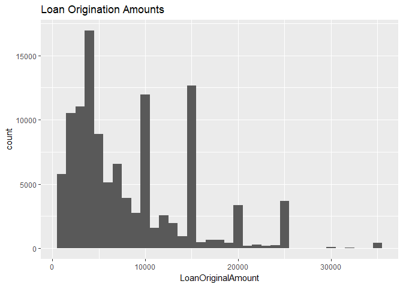<!-- -->

```
##    Min. 1st Qu.  Median    Mean 3rd Qu.    Max. 
##    1000    4000    6500    8337   12000   35000
```

**_So how much are people borrowing?_**  It appears that the bulk of the loans 
are for less than 10,000 dollars with the actual mean of 8,337 dollars. We see 
possible outliers in the $30K-$35K range

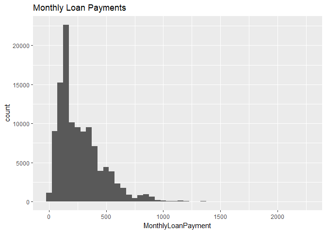<!-- -->

```
##    Min. 1st Qu.  Median    Mean 3rd Qu.    Max. 
##     0.0   131.6   217.7   272.5   371.6  2251.5
```

**_How much are they paying?_**  The mean loan payments are $272 with max of 
2251.50 per month range.

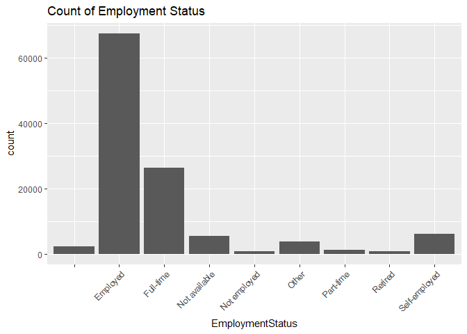<!-- -->

```
##                    Employed     Full-time Not available  Not employed 
##          2255         67322         26355          5347           835 
##         Other     Part-time       Retired Self-employed 
##          3806          1088           795          6134
```

**_So are they working?_**  Most are employed. It would not make much financial 
sense to loan money to people who are unemployed, though there are a relatively 
small number of loans to people who are unemployed.

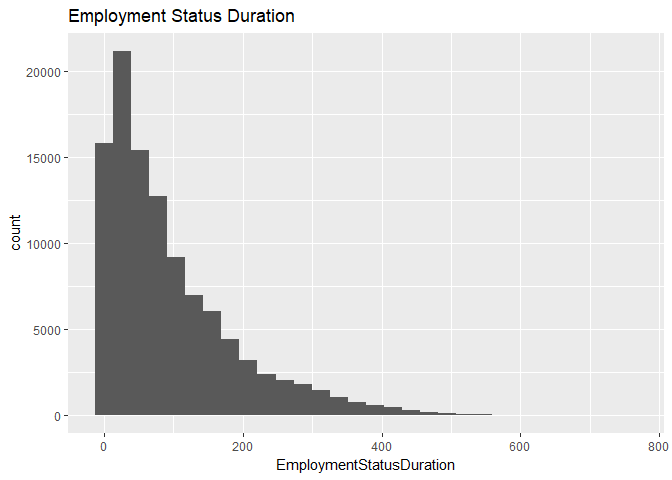<!-- -->

```
##    Min. 1st Qu.  Median    Mean 3rd Qu.    Max.    NA's 
##    0.00   26.00   67.00   96.07  137.00  755.00    7625
```

**_How long have they been employed?_** With bin width set to 24, it appears 
that most loan recipients are employed in the 24-48 month range, actual mean is 96.

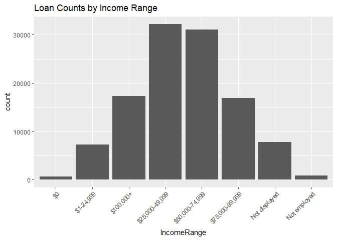<!-- -->

```
##             $0      $1-24,999      $100,000+ $25,000-49,999 $50,000-74,999 
##            621           7274          17337          32192          31050 
## $75,000-99,999  Not displayed   Not employed 
##          16916           7741            806
```

**_How much are they  earning?_** The range goes from zero to $100K and 
appears to be normally distributed, with most people falling between $25K-$75K


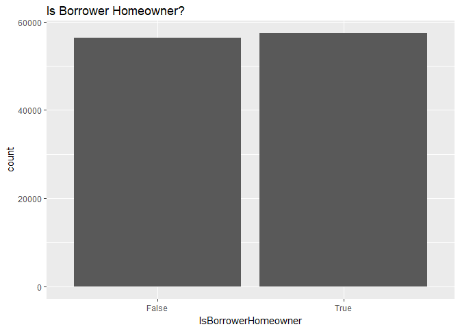<!-- -->

```
## False  True 
## 56459 57478
```

**_Are they homewoners?_** The number of homeowners versus non-homeowners is 
virtually the same

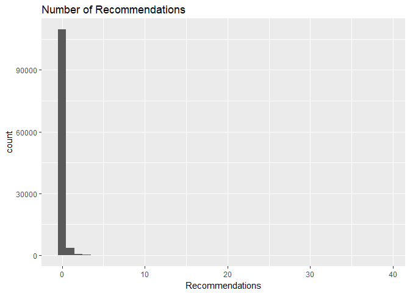<!-- -->

```
##     Min.  1st Qu.   Median     Mean  3rd Qu.     Max. 
##  0.00000  0.00000  0.00000  0.04803  0.00000 39.00000
```
**_Did they have recommendations?_** Most loans requests don't have recommendations and there is a very tall 0.

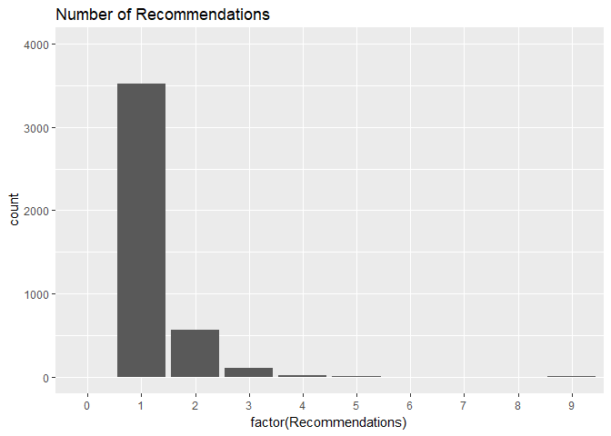<!-- -->

Most loans dont have any recommendations, and when they do it's usually only 
one.  Here we set the limits x, and y axis to exclude the handful of outliers 
around 39 and those with only 1 recommendation to see the remaining distribution


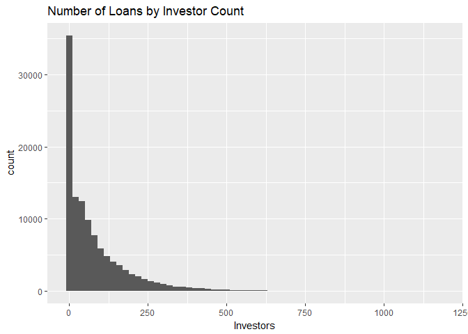<!-- -->

```
##    Min. 1st Qu.  Median    Mean 3rd Qu.    Max. 
##    1.00    2.00   44.00   80.48  115.00 1189.00
```

**_Did they have investors?_**  There is single large bar because about 25% of 
the loans have only a single investor. The average number of investors is about 
80, but the max is 1189 which indcates outliers.  

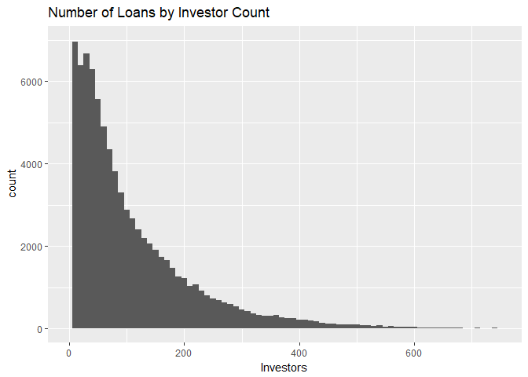<!-- -->

Here we set the x limits to exclude those with only one investor and those 
above 750 so we can zoom in on the remainder of the distribution.

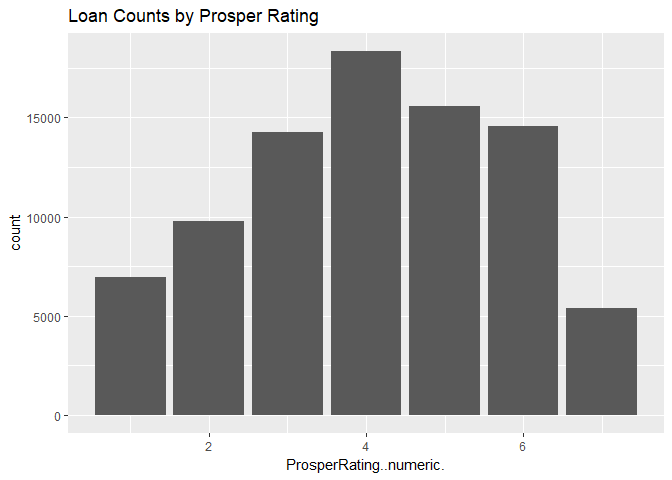<!-- -->

**_Are they a good risk?_**  Next we look at the distribution of the numeric 
version of the Prosper rating. Lower values are high risk, a value of 4 aligns 
roughly to an average credit rating. This distribution also appears to be 
normally distributed

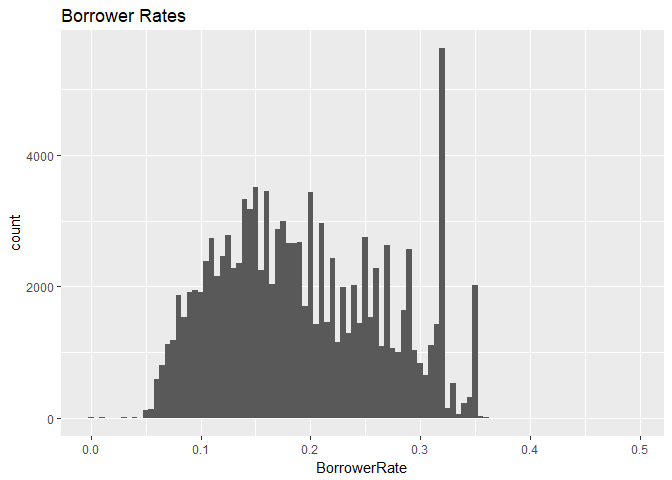<!-- -->

**_What rates are they getting?_**  Borrower Rate range from 0 to .4975. The 
bulk of the loans seem to be near the 0.2 mark, the majority of the users are 
in the middle of the risk ratings.

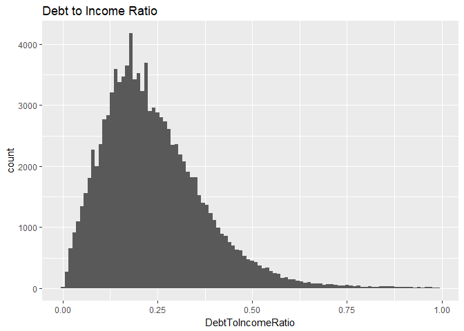<!-- -->

**_Let's look at Debt-to-income-Ratio..._** There are some very high 
debt-to-income ratios, some greater than 10.  I decided to filter those and plot 
ratios less than 1.


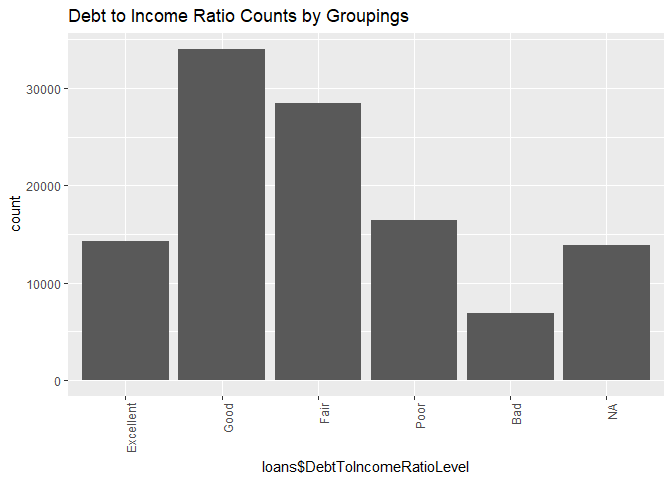<!-- -->

**_Another view of Debt-to-income-Ratio..._**  In this chart I used the custom 
debt-to-Income ratio levels, with ranges at .10 increments.  Most loans fall in 
the level I characterized as 'fair' or better.


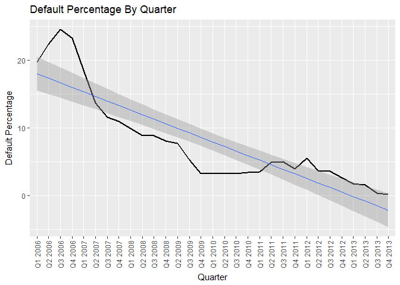<!-- -->

**_Are they defaulting on these loans?_** Defaults on loans have been in 
decline, likely due to improved risk determination over time

# Univariate Analysis

### What is the structure of your dataset?

My dataset is made up of 28 of the 81 total variables of the original dataset. I 
removed the unused variables to make the dataset more manageable for this project. 

### What is/are the main feature(s) of interest in your dataset?

I think the ratings (prosper, credit score, etc) and the debt-to-income ratio 
are of most interest. I think debt income ratio (DTI) can be used as a single 
measure which comprises other risk measures like card utilization, etc

### What other features in the dataset do you think will help support your

Investors and their yield, borrowers and their income and rates

### Did you create any new variables from existing variables in the dataset?

Yes.  I created a variable of renamed listing categories, and a variable 
DebtToIncomeRatioLevel which represents custom levels on DebtToIncomeRatio. 
Finally, I use lubridate to create a variable LoanOriginationDate.year to hold 
the year extracted from the loan origination date

###Of the features you investigated, were there any unusual distributions? \
Did you perform any operations on the data to tidy, adjust, or change the \
form of the data? If so, why did you do this?

I thought it was odd that loans would be approved for applicants with low credit 
ratings or for people who were unemployed. There were missing values many seemed 
appropriate given the loan lifecycle or the dates of certain implementations 
(some things did not exist prioer to 2009).  There seemed to be a large number 
Outliers in the dataset that needed to be filtered in some cases. I did not tidy 
the data by segmenting categories of observations but I took some steps to 
address the default way that dates and factors were imported.

# Bivariate Plots Section

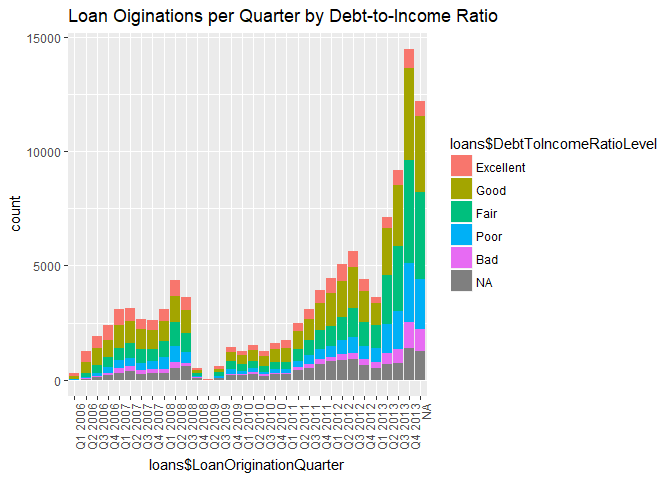<!-- -->

**_Debt to Income Ratio Levels per loans originated._** Here we see breakdown 
of DTI across loan originations.

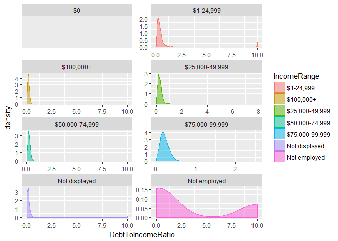<!-- -->

**_Debt-to-income-ratio per income range._**  This chart shows the 
breakout of DTI ratio in relationship to income range.

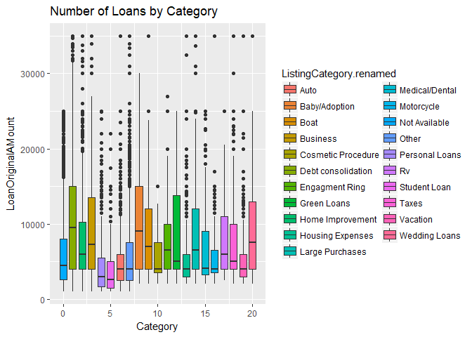<!-- -->

**_Loan origination amounts._** This series of boxplot shows the relative 
distributions of loan categories. A boxlot showsa graphicalpicture of the five 
number summary: minimum, first quartile, median, third quartile, and maximum. 
This view also shows potential outliers.


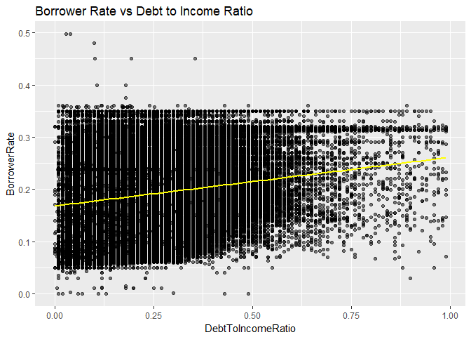<!-- -->

**_Debt-to-Income-Ratio versus Borrower Rate_**. As expected higer risk is 
associated with a person having more debt, higher risk resuts is a higher 
borrower rates

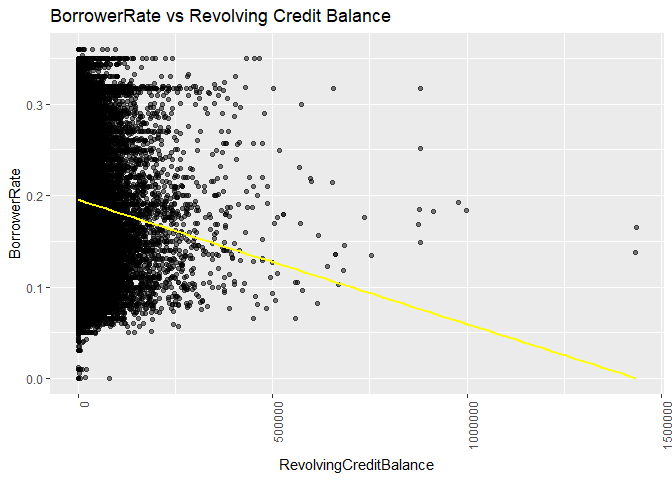<!-- -->

**_Revolving Credit Balance versus Borrower Rate_**.  This appears to be counter 
intuitive.  One would expect th rate to be higher if a person has a large 
revolving credit balance.  This oculd be due to outliers and worther of further 
inspection.

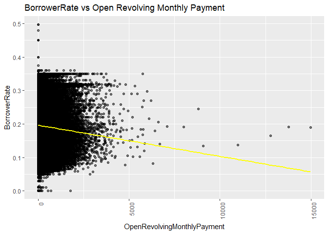<!-- -->

**_Open Revolving Monthly Payment versus Borrower Rate._** This appears to be 
counter intuitive.  One would expect th rate to be higher if a person has a 
large revolving monthly payment.  This oculd be due to outliers and worther of 
further inspection.

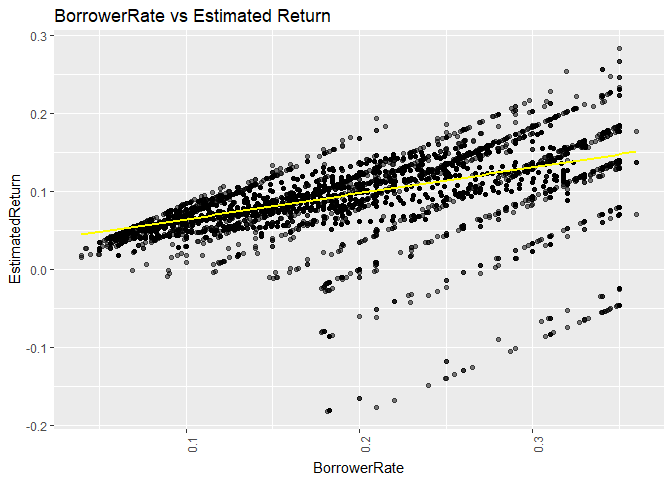<!-- -->

**_Estimated Return versus Borrower Rate._**  There is a positive relationship 
between Borrower Rate and Estimated return.

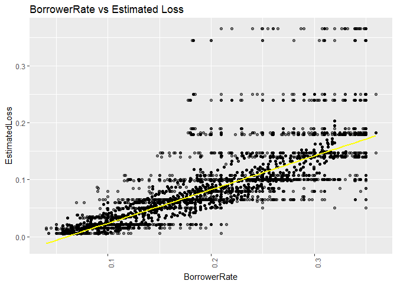<!-- -->

**_Estimated Loss versus Borrower Rate._** As one would expect Borrower Rate and 
affects both expected return and estimated loss.

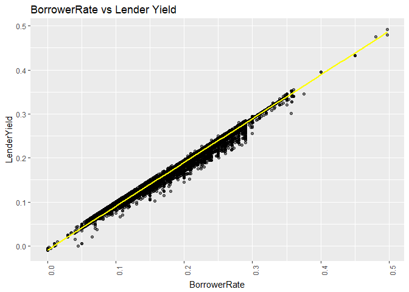<!-- -->

**_Lender Yield versus Borrower Rate._**  Appears to be a very strong 
relationship between Borrower rate and Lender Yield

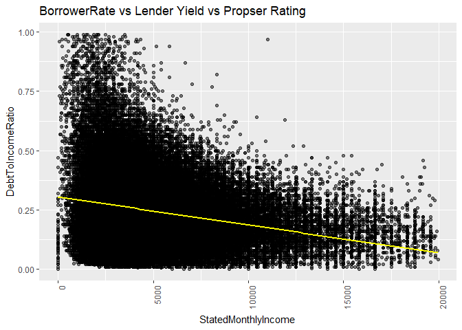<!-- -->

**_Monthly Income versus Deb-to-Income-Ratio._** A lot of overplotting here but 
I decided to leave this chart in, Open points helped somewhat along with the 
regression line. There also appeared to be a lot of outliers in stated monthly 
income.


# Bivariate Analysis

### Talk about some of the relationships you observed in this part of the \
investigation. How did the feature(s) of interest vary with other features \
in the dataset?

Overall, the choosen variables in the data set are highly correlated. Borrower 
Rate and DIT were correlated with the other variables.

### Did you observe any interesting relationships between the other features \
(not the main feature(s) of interest)? 

Lender Yield had a very strong correlation to borrower rate with Lender Yield 
increasing linearly with increase in borrower rate. Also intersting was 
debt-to-income ratio and its relationship to income range. Other varaibles were 
correlated as well. For example, Individuals with a high income recieve larger 
loans with lower rates.

### What was the strongest relationship you found?

The strongest relationship is between BorrowerRate and LenderYield, it was 
almost 1 to 1.

# Multivariate Plots Section

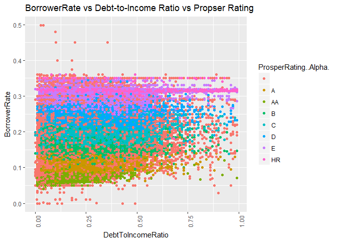<!-- -->

This chart was included in the bivariate section, however it has been colored 
here using the Prosper Rating and included as a multivariate plot. The chart 
shows consistency of rates within the prosper ratings

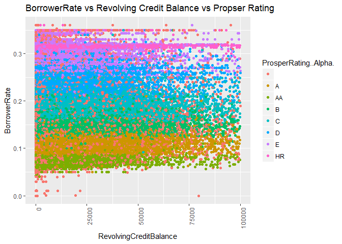<!-- -->

This chart was included in the bivariate section, however it has been colored 
here using the Prosper Rating and included as a multivariate plot. The chart 
shows consistency of rates within the prosper ratings

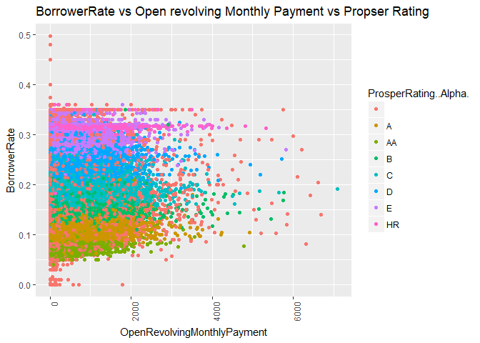<!-- -->

This chart was included in the bivariate section, however it has been colored 
here using the Prosper Rating and included as a multivariate plot. The chart 
shows consistency of rates within the prosper ratings

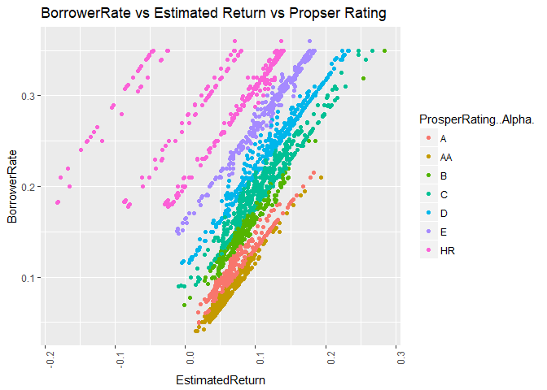<!-- -->

This chart was included in the bivariate section, however it has been colored 
here using the Prosper Rating and included as a multivariate plot. The chart 
shows consistency of rates within the prosper ratings

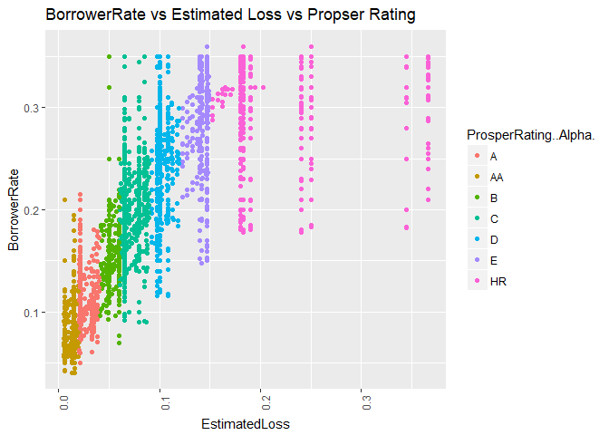<!-- -->

This chart was included in the bivariate section, however it has been colored 
here using the Prosper Rating and included as a multivariate plot. The chart 
shows consistency of rates within the prosper ratings

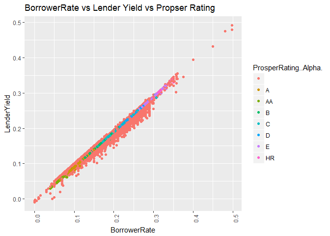<!-- -->

Borrower Rate and LenderYield are highly correlated. This chart was included in 
the bivariate section, however it has been colored here using the Prosper Rating 
and included as a multivariate plot. The chart shows consistency of Rates within 
the prosper ratings

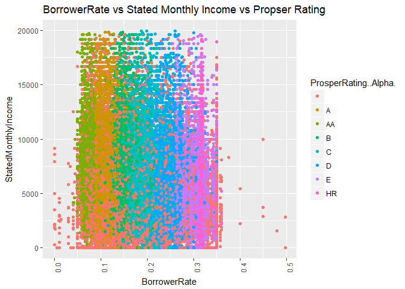<!-- -->

Rate and monthly income are weakly correlated but adding the credit rating 
indicates that rates are consistent across similar income levels

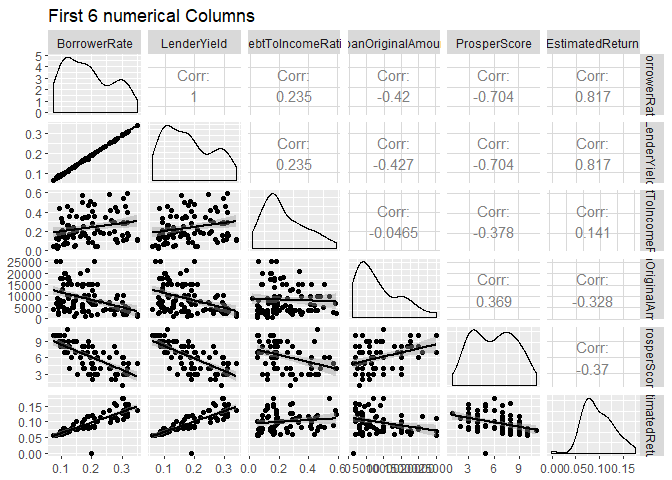<!-- -->

Correlation matrix to summarize and quantify some of the relationships noted 
earlier

# Multivariate Analysis

### Talk about some of the relationships you observed in this part of the \
investigation. Were there features that strengthened each other in terms of \
looking at your feature(s) of interest?

This analysis helps us better understand the risk and estimated losses for 
investing in a borrowesr with certain ratings and other factors. We investigated 
the relationship between debt, income and monthly loan payments for our 
borrowers.

### Were there any interesting or surprising interactions between features?

Most Investors prefer to invest in low risk, low borrower rate loans despite the 
high lender yield for loans taken on higher borrower rate. Revolving Debt and 
revolving debt payments seemed to correlated in the opposite direction.

### OPTIONAL: Did you create any models with your dataset? Discuss the \
strengths and limitations of your model.

No. I did not attempt to create a model.

------

# Final Plots and Summary

### Plot One

<!-- -->

### Description One

While the number of loans originated has increased, this chart shows that the 
proportion of new loans with better (lower) DIT ratios has also increased.

### Plot Two

<!-- -->


### Description Two

I’ve chosen this plot because shows the default rate (in percentage) of loans 
over the years. It provides supporting evidence for the claim I've made in plot 
one, that better debt-to-income ratios lead to reduced defaults.

### Plot Three

<!-- -->

### Description Three

I’ve chosen this plot because shows strong relationship between borrower rate 
and the estimated return.

------

# Reflection

Prior to beginning work on the project I assumed that there would be data 
related to requests that did not become loans. I was interested to know about 
requests that were not funded and why.  However, after looking into the data it 
appeared to contain only data for funded loans so I had to modify my approach. 
My initial challenges with the data were related to the importation itself.  It 
appears that R imports dates and other strings a factors by default and that 
it’s not very good at doing so.  This dataset revealed to me the importance of 
having a level of domain knowledge with respect to the data.  I spent a lot of 
time trying to familiarize myself with the lending domain and its terminology 
and many of the terms meant almost nothing to me and this made it hard for me to 
know where to look for possible relationships because I had no “intuition” 
regarding the data.  The primary takeaway for me was that these types of 
industries need to constantly work toward improved risk identification and 
mitigation policies in order to reduce defaults and increase investor yields. 
As noted above, the relatiohships between revolving credit amounts and monthly 
payment and borrower rate are counter to my expectation, future work might 
investigate this further.

------

# References
PDF: [R Markdown Cheatsheet](http://bit.ly/1SuNTo9)    
    
SITE: [Computing by groups within data.frames with dplyr and broom:](http://bit.ly/2oOhWQr)    
SITE: [Cookbook for R](http://bit.ly/1iyqHp7)    
SITE: [Seven Easy Graphs to Visualize Correlation Matrices in R](http://bit.ly/2I0bcrJ)  
SITE: [Binning Outliers in a Histogram](http://bit.ly/2H4gOQh)
    
BOOK: R for Data Science, by Hadley Wicham & Garrett Grolemund     
BOOK: R in Action: Data Analysis and Graphics in R, by Robert I. Kabacoff    


